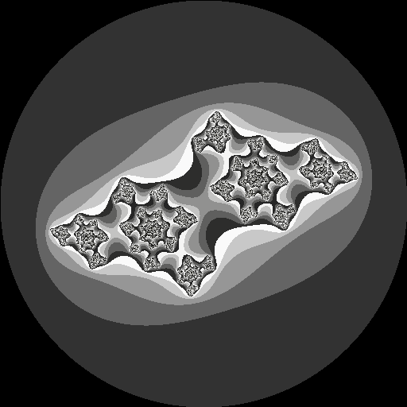

# julia.rb

🍷🍷🍷 Rubyでジュリア集合を描画しましょう！  

  

## 実行方法

```shell
docker compose up julia -d [--build]
```

設定ファイル(config.yaml)を変更して、ジュリア集合の描写を変更することができます。  

---

DevContainer内に入って、開発をすることもできます。  
その場合は、以下のコマンドを実行してください。  

```shell
ruby ./app/main.rb
```
